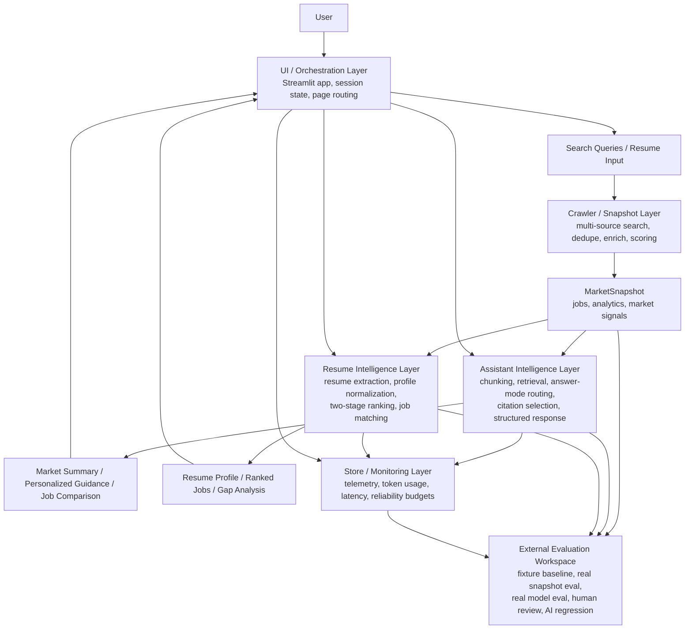

# Figure 3-1 系統整體架構圖

這份文件提供論文 `Figure 3-1` 的第一版圖稿與圖說，可直接作為：

- 論文草稿中的 Mermaid 圖
- 後續轉成 draw.io / Figma / PowerPoint 正式圖的基礎

---

## 圖名

`Figure 3-1. Overall Architecture of the Job-Market AI Assistance System`

## 正式圖檔

---

## 圖說

本系統由四個主要層次組成：`UI / orchestration layer`、`crawler / snapshot layer`、`assistant / resume intelligence layer` 與 `store / monitoring / evaluation layer`。使用者由前端進入系統後，首先透過搜尋與履歷互動觸發職缺市場快照建立；該快照再同時供應 RAG 問答與履歷匹配模組使用。系統在提供回答與匹配結果的同時，也將 telemetry、token usage 與評估結果回寫至產品狀態儲存與外部評估工作區，以支撐產品監控與正式驗證。

---

## Mermaid 圖稿

---

## 論文內文可直接引用版本

建議在 `Chapter 3.1 系統整體架構` 搭配下列敘述：

> 如 Figure 3-1 所示，本研究之系統並非單一問答模組，而是由前端協調層、多來源職缺快照層、AI 問答與履歷匹配層，以及監控與評估層共同組成。`MarketSnapshot` 作為系統內部的共同知識表示，同時支撐 assistant 問答、resume matching 與外部評估流程，形成一條可產品化且可回歸驗證的 AI 主線。

---

## 後續可視化優化

若要轉成正式論文圖，可再做這些調整：

1. 把四個 layer 改成四個水平區塊
2. 用顏色區分：
   - 產品執行路徑
   - 評估與監控路徑
3. 將 `MarketSnapshot` 畫成中央共享資料物件
4. 將 `External Evaluation Workspace` 畫成獨立右側區塊，強調其為研究與回歸用途

---

## 與其他章節的對應

- [ai_thesis_chapter3_draft.md](/Users/zhuangcaizhen/Desktop/專案/職缺爬蟲/docs/ai_thesis_chapter3_draft.md)
- [ai_thesis_chapter4_draft.md](/Users/zhuangcaizhen/Desktop/專案/職缺爬蟲/docs/ai_thesis_chapter4_draft.md)
- [ai_thesis_figures_tables_plan.md](/Users/zhuangcaizhen/Desktop/專案/職缺爬蟲/docs/ai_thesis_figures_tables_plan.md)
