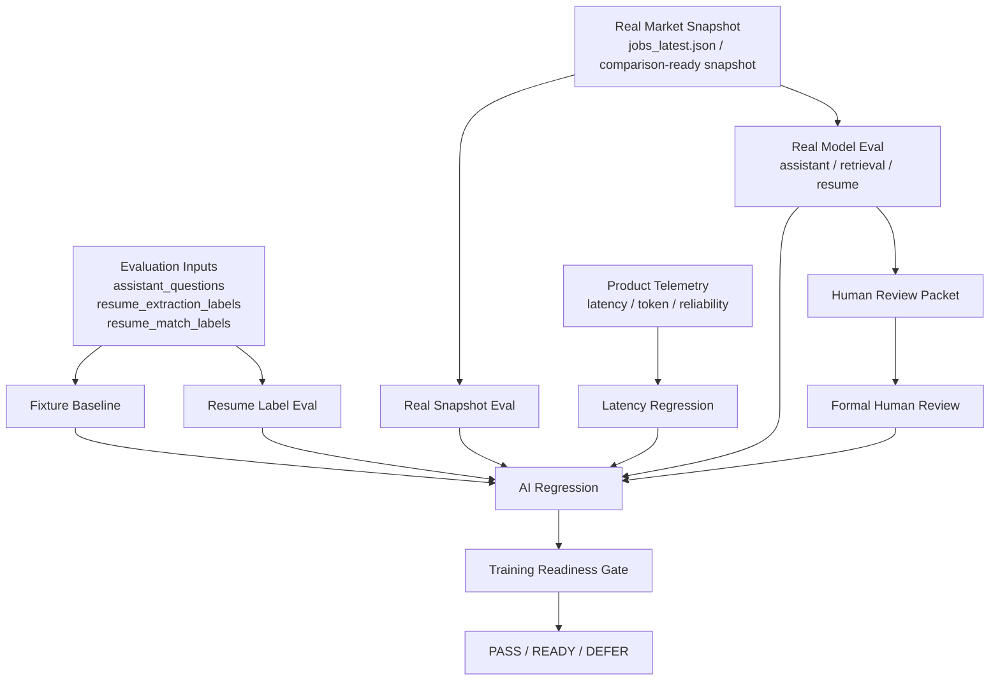

# Figure 4-1 評估流程總覽圖

這份文件提供論文 `Figure 4-1` 的第一版圖稿與圖說，用於說明本研究的完整評估流程。可直接作為：

- 論文草稿中的 Mermaid 圖
- 後續轉成正式論文圖的基礎

---

## 圖名

`Figure 4-1. Overview of the Evaluation Pipeline`

## 正式圖檔

---

## 圖說

本研究採用多層評估流程，而非單一 benchmark。流程由資料集與真實快照開始，依序進入 fixture baseline、real snapshot eval、real model eval、resume label eval 與 formal human review，再由 AI regression 與 training readiness gate 對整體品質、延遲、人工評分與產品可用性做最終判讀。這種設計使系統評估同時涵蓋 correctness、evidence grounding、排序品質、延遲、token 成本與人工接受度，而不是僅依靠單次自動指標。

---

## Mermaid 圖稿

---

## 論文內文可直接引用版本

建議在 `Chapter 4` 搭配下列敘述：

> 如 Figure 4-1 所示，本研究的評估流程並非單一 benchmark，而是由多層驗證組成。首先，固定資料集與 fixture baseline 提供邏輯與 regression 驗證；其次，real snapshot eval 與 real model eval 驗證系統在真實快照與真實模型條件下的行為；再者，resume label eval 針對職缺排序品質提供補充；最後，formal human review 與 latency regression 分別從人工接受度與產品可用性角度進行正式檢查，並由 AI regression 與 training readiness gate 對整體系統做最終判讀。

---

## 圖中節點說明

### Evaluation Inputs

包含本研究建立的主要評估資料集：

- `assistant_questions`
- `resume_extraction_labels`
- `resume_match_labels`

### Fixture Baseline

第一層 regression，用於固定資料條件下驗證：

- assistant 基本問答邏輯
- retrieval 行為
- resume matching 基本 correctness

### Real Snapshot Eval

使用真實市場快照檢查：

- snapshot health
- 真實資料欄位覆蓋
- retrieval 與 assistant 在真實快照下的可用性

### Real Model Eval

使用真實模型設定，分別評估：

- assistant mode-aware 表現
- retrieval 真實延遲與 evidence type
- resume extraction / matching 表現

### Resume Label Eval

補充排序層面的正式評估，量測：

- `top1_best_label_hit_rate`
- `pairwise_order_accuracy`
- `nDCG@3`

### Human Review

由 blind review packet 出發，經 reviewer 填寫後做：

- validation
- aggregation
- verdict agreement
- thesis table export

### Latency Regression

依產品 telemetry 與既定門檻，檢查：

- assistant latency
- retrieval latency
- resume latency
- warm path latency

### AI Regression

將 snapshot health、assistant quality、resume quality、latency 與 human review 統整成主線總 gate。

### Training Readiness Gate

不是直接要求訓練，而是判斷：

- 是否已經具備進入 fine-tuning 的必要條件
- 或是否應維持 `DEFER`

---

## 與正式結果的對應檔案

圖中各節點對應的主要結果如下：

- fixture / baseline / regression：
  - `/Users/zhuangcaizhen/Desktop/專案/job-radar-eval/results`
- 主線總 gate：
  - [/Users/zhuangcaizhen/Desktop/專案/job-radar-eval/results/ai_regression_20260408_002941/summary.json](/Users/zhuangcaizhen/Desktop/專案/job-radar-eval/results/ai_regression_20260408_002941/summary.json)
- formal human review：
  - [/Users/zhuangcaizhen/Desktop/專案/job-radar-eval/results/formal_human_review_20260408_002923/summary.json](/Users/zhuangcaizhen/Desktop/專案/job-radar-eval/results/formal_human_review_20260408_002923/summary.json)

---

## 後續可視化優化

若要轉成正式論文圖，建議：

1. 將 `Evaluation Inputs` 放在左側
2. 將 `offline / snapshot / real model / human review / telemetry` 用不同顏色區分
3. 把 `AI Regression` 與 `Training Readiness Gate` 放在最右側，作為總判定
4. 在正式版圖中標出：
   - data path
   - product path
   - research validation path

---

## 與其他文件的對應

- [ai_thesis_chapter4_draft.md](/Users/zhuangcaizhen/Desktop/專案/職缺爬蟲/docs/ai_thesis_chapter4_draft.md)
- [ai_mainline_summary.md](/Users/zhuangcaizhen/Desktop/專案/職缺爬蟲/docs/ai_mainline_summary.md)
- [ai_thesis_figures_tables_plan.md](/Users/zhuangcaizhen/Desktop/專案/職缺爬蟲/docs/ai_thesis_figures_tables_plan.md)
