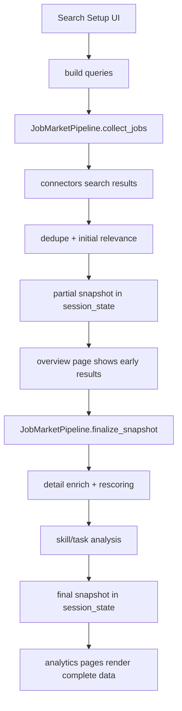
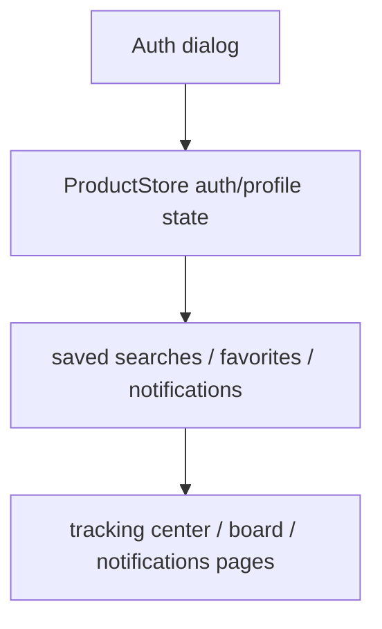
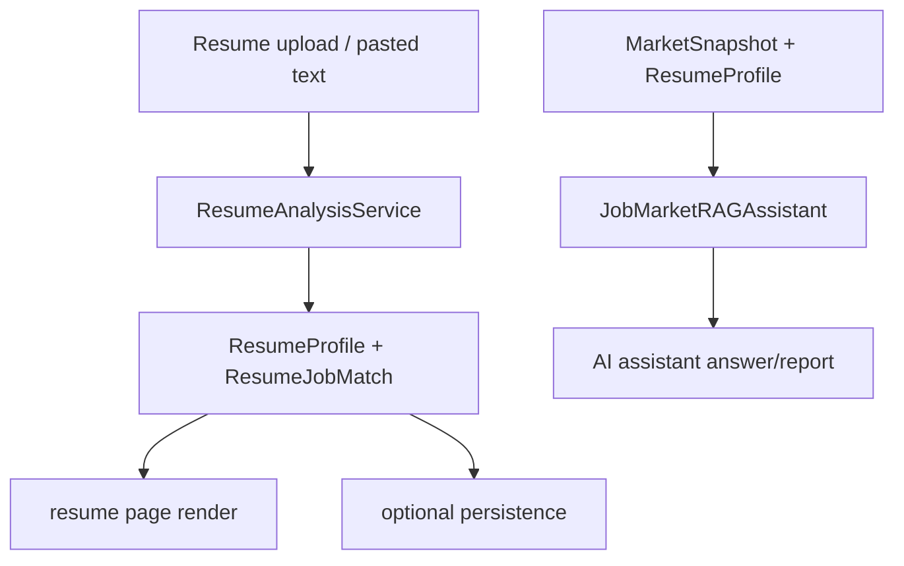

# 系統架構

這份文件描述目前專案的主要分層、資料流，以及後續維護時最需要掌握的邊界。

## 1. 系統分層

### 入口層

- [app.py](/Users/zhuangcaizhen/Desktop/專案/職缺爬蟲/app.py)
  - Streamlit 主入口
  - 只保留高層 bootstrap、shell render、page dispatch
  - 透過 UI runtime 模組組裝，不再直接持有 staged crawl 或 routing 細節

### UI 層

- [/Users/zhuangcaizhen/Desktop/專案/職缺爬蟲/src/job_spy_tw/ui/common.py](/Users/zhuangcaizhen/Desktop/專案/職缺爬蟲/src/job_spy_tw/ui/common.py)
  - header、hero、footer、共用 HTML/文本格式化
- [/Users/zhuangcaizhen/Desktop/專案/職缺爬蟲/src/job_spy_tw/ui/search_setup.py](/Users/zhuangcaizhen/Desktop/專案/職缺爬蟲/src/job_spy_tw/ui/search_setup.py)
  - 搜尋設定卡的 rendering 與行為
- [/Users/zhuangcaizhen/Desktop/專案/職缺爬蟲/src/job_spy_tw/ui/pages_market.py](/Users/zhuangcaizhen/Desktop/專案/職缺爬蟲/src/job_spy_tw/ui/pages_market.py)
  - 職缺總覽、工作內容統計、技能地圖、來源比較、下載資料
- [/Users/zhuangcaizhen/Desktop/專案/職缺爬蟲/src/job_spy_tw/ui/pages_resume_assistant.py](/Users/zhuangcaizhen/Desktop/專案/職缺爬蟲/src/job_spy_tw/ui/pages_resume_assistant.py)
  - 履歷匹配與 AI 助理
- [/Users/zhuangcaizhen/Desktop/專案/職缺爬蟲/src/job_spy_tw/ui/pages_product.py](/Users/zhuangcaizhen/Desktop/專案/職缺爬蟲/src/job_spy_tw/ui/pages_product.py)
  - 追蹤中心、投遞看板、通知設定
- [/Users/zhuangcaizhen/Desktop/專案/職缺爬蟲/src/job_spy_tw/ui/renderers.py](/Users/zhuangcaizhen/Desktop/專案/職缺爬蟲/src/job_spy_tw/ui/renderers.py)
  - 職缺卡片、履歷卡、AI 回答卡等元件
- [/Users/zhuangcaizhen/Desktop/專案/職缺爬蟲/src/job_spy_tw/ui/charts.py](/Users/zhuangcaizhen/Desktop/專案/職缺爬蟲/src/job_spy_tw/ui/charts.py)
  - Altair 圖表
- [/Users/zhuangcaizhen/Desktop/專案/職缺爬蟲/src/job_spy_tw/ui/session.py](/Users/zhuangcaizhen/Desktop/專案/職缺爬蟲/src/job_spy_tw/ui/session.py)
  - session state 初始化、同步、頁籤切換、snapshot frame cache
- [/Users/zhuangcaizhen/Desktop/專案/職缺爬蟲/src/job_spy_tw/ui/bootstrap.py](/Users/zhuangcaizhen/Desktop/專案/職缺爬蟲/src/job_spy_tw/ui/bootstrap.py)
  - app runtime bootstrap
  - service/store 建立
  - 訪客 session、visit counter、登入使用者狀態恢復
- [/Users/zhuangcaizhen/Desktop/專案/職缺爬蟲/src/job_spy_tw/ui/crawl_runtime.py](/Users/zhuangcaizhen/Desktop/專案/職缺爬蟲/src/job_spy_tw/ui/crawl_runtime.py)
  - staged crawl 狀態機
  - partial snapshot -> finalize batch 協調
  - saved-search sync 與通知發送串接
- [/Users/zhuangcaizhen/Desktop/專案/職缺爬蟲/src/job_spy_tw/ui/router.py](/Users/zhuangcaizhen/Desktop/專案/職缺爬蟲/src/job_spy_tw/ui/router.py)
  - 主頁導航項目
  - selected tab 正規化
  - page dispatch
- [/Users/zhuangcaizhen/Desktop/專案/職缺爬蟲/src/job_spy_tw/ui/context_builder.py](/Users/zhuangcaizhen/Desktop/專案/職缺爬蟲/src/job_spy_tw/ui/context_builder.py)
  - PageContext 組裝
  - 把 app runtime state 轉成 page render payload
- [/Users/zhuangcaizhen/Desktop/專案/職缺爬蟲/src/job_spy_tw/ui/resources.py](/Users/zhuangcaizhen/Desktop/專案/職缺爬蟲/src/job_spy_tw/ui/resources.py)
  - UI 所需 service/store factory

### 抓取與分析層

- [/Users/zhuangcaizhen/Desktop/專案/職缺爬蟲/src/job_spy_tw/pipeline.py](/Users/zhuangcaizhen/Desktop/專案/職缺爬蟲/src/job_spy_tw/pipeline.py)
  - 搜尋結果收集、detail enrich、低相關過濾、技能/工作內容統計、快照輸出
- [/Users/zhuangcaizhen/Desktop/專案/職缺爬蟲/src/job_spy_tw/connectors/](/Users/zhuangcaizhen/Desktop/專案/職缺爬蟲/src/job_spy_tw/connectors/)
  - `104 / 1111 / Cake / LinkedIn` 來源接點
- [/Users/zhuangcaizhen/Desktop/專案/職缺爬蟲/src/job_spy_tw/market_analysis/analyzer.py](/Users/zhuangcaizhen/Desktop/專案/職缺爬蟲/src/job_spy_tw/market_analysis/analyzer.py)
  - 技能與工作內容分析
- [/Users/zhuangcaizhen/Desktop/專案/職缺爬蟲/src/job_spy_tw/utils.py](/Users/zhuangcaizhen/Desktop/專案/職缺爬蟲/src/job_spy_tw/utils.py)
  - request fetcher 與 cache

### 履歷與 AI 層

- [/Users/zhuangcaizhen/Desktop/專案/職缺爬蟲/src/job_spy_tw/resume/](/Users/zhuangcaizhen/Desktop/專案/職缺爬蟲/src/job_spy_tw/resume/)
  - 履歷抽字、摘要、匹配、評分
- [/Users/zhuangcaizhen/Desktop/專案/職缺爬蟲/src/job_spy_tw/assistant/](/Users/zhuangcaizhen/Desktop/專案/職缺爬蟲/src/job_spy_tw/assistant/)
  - RAG chunk、retrieval、prompt、service

### 儲存與通知層

- [/Users/zhuangcaizhen/Desktop/專案/職缺爬蟲/src/job_spy_tw/store/](/Users/zhuangcaizhen/Desktop/專案/職缺爬蟲/src/job_spy_tw/store/)
  - saved search、favorites、notifications、profiles、auth、database
- [/Users/zhuangcaizhen/Desktop/專案/職缺爬蟲/src/job_spy_tw/notifications/](/Users/zhuangcaizhen/Desktop/專案/職缺爬蟲/src/job_spy_tw/notifications/)
  - email / line channel 與訊息封裝

## 2. 主要資料流

### A. 抓取與顯示

### B. 使用者資料流

### C. 履歷與 AI 資料流

## 3. 抓取流程的 staged 設計

目前抓取改成兩階段：

### 第一階段：collect_jobs

- 各來源抓搜尋結果
- dedupe
- 初步 relevance score
- 先建立 partial snapshot
- `職缺總覽` 可先顯示

### 第二階段：finalize_snapshot

- 依 relevance 補 detail
- rescoring
- low relevance filter
- 技能統計 / 工作內容統計
- 最終 snapshot 覆蓋 partial snapshot

### 設計理由

- 使用者不必等完整分析才看到第一批結果
- 較重的 detail enrich 與統計工作不會阻塞職缺列表
- UI 能清楚區分「已取得初步結果」和「完整分析完成」

## 4. 關鍵 session state

最重要的是這幾組：

- `snapshot`
  - 目前畫面使用的快照
- `crawl_phase`
  - `idle / collecting / finalizing`
- `crawl_pending_queries`
- `crawl_pending_jobs`
- `crawl_pending_errors`
- `crawl_detail_cursor`
- `main_tab_selection`
  - 主頁切換
- `current_user`
  - 當前使用者

維護原則：

- 與畫面切換相關的狀態放 UI session 層
- 與抓取中間態相關的狀態只保留在 staged crawl 需要的最小集合
- 不要把 store/service 實例直接塞到 session state

## 5. 目前已做的降耦合整理

### 已完成

- `app.py` 已再拆出三個 orchestration 模組
  - `bootstrap.py`
  - `crawl_runtime.py`
  - `router.py`
- `PageContext` 組裝已抽到 `context_builder.py`
- `styles.py` 已拆成多個 style fragment
  - `base_theme_styles.py`
  - `header_auth_styles.py`
  - `hero_styles.py`
  - `surface_styles.py`
  - `search_setup_styles.py`
  - `overview_styles.py`
  - `navigation_styles.py`
  - `assistant_launcher_styles.py`
- `SEARCH SETUP` 已從 `app.py` 拆到獨立模組
- `職缺總覽`、`履歷匹配/AI 助理`、`產品頁面` 已分成 page module
- 未使用的 UI dead code 已移除
  - `render_page_decor`
  - `render_source_role_heatmap`
  - `_format_snapshot_timestamp`
  - `render_count_bubble_chart`

### 仍然偏耦合的地方

- [app.py](/Users/zhuangcaizhen/Desktop/專案/職缺爬蟲/app.py)
  - 已變薄，但仍是所有 runtime 模組的組裝點
- [pages_product.py](/Users/zhuangcaizhen/Desktop/專案/職缺爬蟲/src/job_spy_tw/ui/pages_product.py)
  - tracking / board / notifications 還是偏大
- [pages_resume_assistant.py](/Users/zhuangcaizhen/Desktop/專案/職缺爬蟲/src/job_spy_tw/ui/pages_resume_assistant.py)
  - 履歷匹配與 AI 助理仍放同檔
- [search.py](/Users/zhuangcaizhen/Desktop/專案/職缺爬蟲/src/job_spy_tw/ui/search.py)
  - 仍保留 `priority` 隱性相容邏輯

## 6. 建議維護方式

### 改 UI

- 先找 page module
- 再找 render helper
- 最後才改 style fragment

### 改抓取

- 先看 connector
- 再看 pipeline
- 最後才看 UI progress state

### 改資料表與持久化

- 先看 `store/database.py`
- 再看對應 feature module
- 不要先改 facade

## 7. 下一輪最值得再拆的點

1. `pages_product.py` 再拆成
   - `tracking_page.py`
   - `board_page.py`
   - `notifications_page.py`
2. `pages_resume_assistant.py` 再拆成
   - `resume_page.py`
   - `assistant_page.py`
3. `pages_market.py` 內再把 overview / analytics / export 分拆
