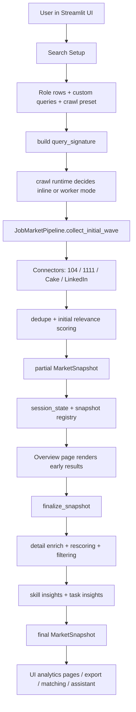
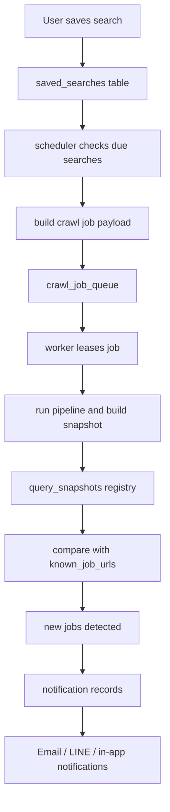
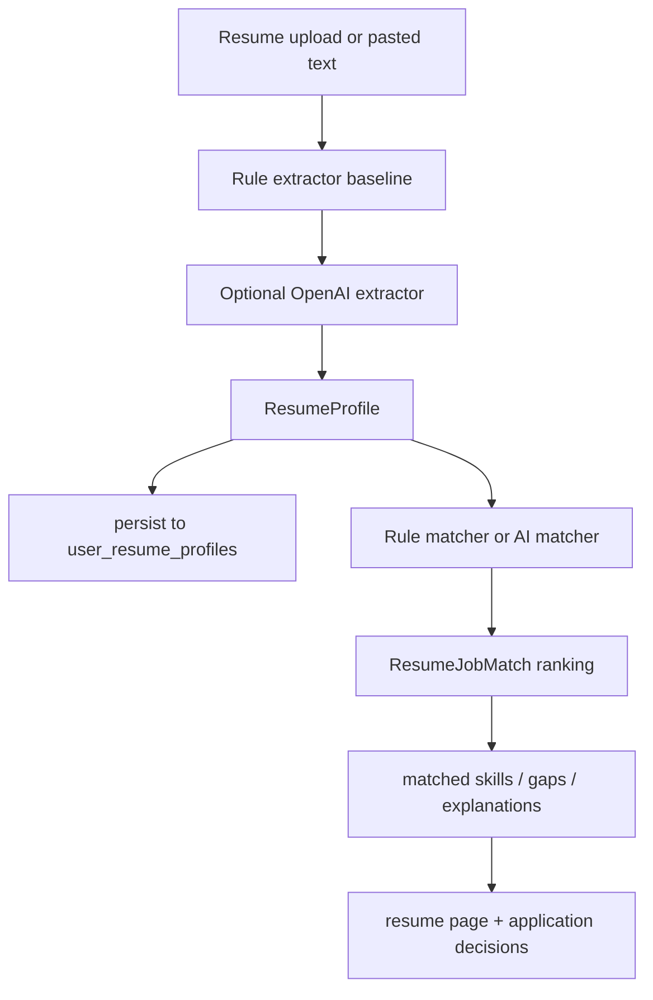
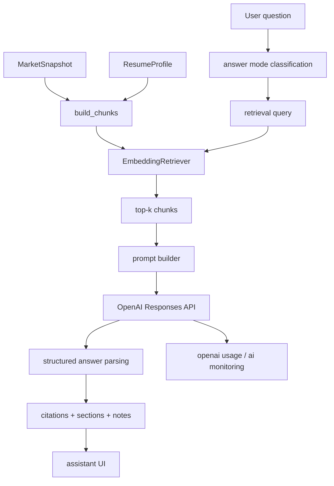
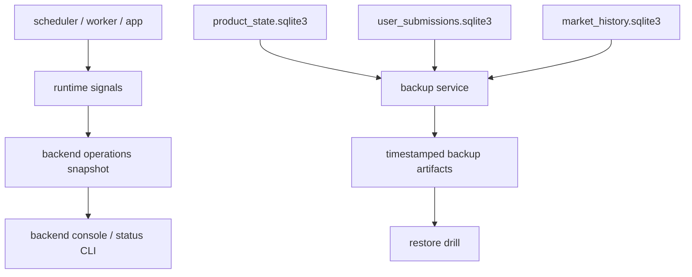

# 產品化與求職定位評估

這份文件不是功能說明，而是把目前專案整理成「可以拿去面試講」的版本。

目標有三個：

1. 判斷這個專案是否已經具備接近產品的骨架
2. 把端到端資料流講清楚
3. 明確區分它對 `AI 應用工程師 / LLM 工程師 / 資料科學家` 三種職缺的說服力

---

## 1. 先講結論

### 可以，但定位要講對

這個專案已經不是單純的職缺爬蟲。

它已經具備下列產品級元素：

- 多來源資料擷取
- 結構化資料模型
- 使用者狀態與持久化
- 搜尋保存與通知
- scheduler / worker / snapshot cache
- 履歷分析與職缺匹配
- RAG 問答
- backend status / backup / restore drill
- 部署設定

所以答案是：

- **可以做成接近產品**
- **可以拿去投 AI 應用工程師**
- **可以拿去投偏應用型的 LLM 工程師**
- **也能拿去投資料科學家，但這一塊目前證據相對弱，還要補 evaluation / labeling / metrics**

### 最適合的職缺排序

以目前專案完成度來看，最有說服力的順序是：

1. `AI 應用工程師`
2. `LLM 工程師（偏應用 / RAG / orchestration）`
3. `資料科學家`

原因很直接：

- 你最強的是把多個系統模組串成可運作產品
- 你已經開始做 LLM、retrieval、resume matching、usage monitoring
- 但資料科學職缺通常還會期待更完整的標註集、實驗設計、評估指標、報表與模型比較

---

## 2. 目前可以主打的產品骨架

### A. 使用者工作流是成立的

你的主線不是「抓資料」，而是：

1. 使用者設定目標職缺
2. 系統抓多來源職缺
3. 系統整理市場與技能需求
4. 使用者上傳履歷
5. 系統做履歷摘要、匹配、缺口分析
6. 使用者再用 AI 助理追問
7. 系統保存搜尋、推播新職缺、管理投遞狀態

這條線已經接近產品，而不是單點功能 demo。

### B. 後端運作骨架也是成立的

你不是只有 UI。

目前已經有：

- `snapshot` 作為核心資料交換物件
- `query_signature` 作為查詢快取 key
- `query_snapshots` + `crawl_job_queue` 作為 runtime backend
- `scheduler + worker` 作為背景更新模型
- `ai_monitoring_events` 作為 AI 呼叫觀測
- `sqlite backup / restore drill / backend status` 作為營運與維護能力

這些都很加分，因為它們能證明你有系統思維，而不是只會寫 prompt。

---

## 3. 端到端系統資料流

## 3.1 使用者主動觸發搜尋

### 這條 flow 代表的工程價值

- 你有做 staged crawl，不是把所有工作都塞進單一同步流程
- 你有 partial 與 final snapshot 語意
- 你有可重用的 snapshot model，讓 UI、matching、assistant 共用同一份市場資料

---

## 3.2 Saved Search 與背景刷新

### 這條 flow 代表的工程價值

- 你已經把「手動查一次」提升成「持續追蹤」
- 這是產品和工具的分水嶺之一
- 對 `AI 應用工程師` 來說，這比單純多一個模型更有說服力

---

## 3.3 履歷分析與職缺匹配

### 這條 flow 代表的工程價值

- 你不是只做聊天機器人，而是有明確的 ranking 任務
- 你有 baseline 與 AI fallback 結構
- 這讓專案更像 AI 應用系統，而不是純 prompt demo

---

## 3.4 RAG 問答資料流

### 這條 flow 代表的工程價值

- 你有 retrieval，不是直接把整包資料丟給模型
- 你有 citation 與 answer mode
- 你開始追 usage / latency / token budget
- 這已經可以講成 `LLM application engineering` 或 `RAG system design`

---

## 3.5 營運與可維護性資料流

### 這條 flow 代表的工程價值

- 你有營運層 thinking，不只會做功能
- 面試時這會讓你比很多只有 notebook 或單頁 demo 的人強

---

## 4. 對三種職缺的說服力

## 4.1 AI 應用工程師

### 現在就可以主打

最能打的點：

- 多來源資料整合
- 產品型 UI 與使用者流程
- 個人化功能
- 通知與追蹤
- background job / cache / runtime state
- LLM 功能真的嵌進產品流程

### 面試時應該這樣講

不要說：

- 我做了一個爬蟲加聊天機器人

應該說：

- 我把台灣求職市場資料做成一個可持續運作的職缺 intelligence workspace，核心包含多來源 crawl、snapshot cache、resume-job ranking、RAG assistant、saved search refresh 與通知流程

---

## 4.2 LLM 工程師

### 有機會，但要走應用型敘事

你現在能講的不是訓練模型，而是：

- RAG chunking
- embedding retrieval
- prompt orchestration
- structured answer parsing
- resume extraction with fallback
- AI latency / token monitoring
- eval roadmap 與 dataset spec

### 還缺什麼

- offline eval runner
- retrieval metrics
- answer quality rubric
- structured outputs 更嚴格 schema 化
- reranking / hybrid retrieval

如果把這幾個補起來，你對 `LLM Engineer (Applied)` 的說服力會大幅提高。

---

## 4.3 資料科學家

### 可以投，但目前要誠實

你有一些 DS 相關素材：

- 市場資料清理與標準化
- taxonomy / skill insight
- ranking problem
- 指標與資料集規格意識

但目前還不夠強的地方是：

- 沒有完整標註集
- 沒有 baseline 對照報表
- 沒有明確實驗追蹤
- 沒有 ranking / extraction / retrieval 的量化結果

### 這代表什麼

如果你投的是偏 `產品資料科學 / Applied Scientist / Ranking / NLP DS`，還有機會。

如果投的是偏傳統 `Data Scientist`，你需要補更強的：

- 標註資料
- 實驗設計
- 指標報表
- 結果分析

---

## 5. 目前距離「更像產品」還差的關鍵

不是再加功能，而是把下面幾件事補齊。

### A. onboarding 與第一次使用路徑

現在功能很完整，但第一次進來的人不一定知道：

- 先做搜尋
- 再看市場分析
- 再上傳履歷
- 最後用 AI 助理追問

如果把這條首用路徑做順，產品感會明顯提升。

### B. AI evaluation

這是你從「會串 API」變成「像 LLM 工程師」的關鍵。

至少要補：

- `assistant_questions.jsonl`
- `resume_extraction_labels.jsonl`
- `resume_match_labels.jsonl`
- baseline metrics report

### C. freshness 與 data contracts

你已經有 partial / final snapshot，下一步要把資料契約再講清楚：

- 哪些頁面允許讀 partial snapshot
- 哪些統計只能讀 finalized data
- snapshot freshness 怎麼定義

### D. demo-ready deployment story

你已經有 `Dockerfile`、`docker-compose.yml`、`render.yaml`。

接下來要補的是：

- demo 環境說明
- sample account / sample data
- 隱私與資料保存說明

這會讓面試官更容易相信它是可用系統，而不是只能在你電腦上跑。

---

## 6. 建議你接下來 2 到 4 週補的內容

### 如果目標是 AI 應用工程師

優先順序：

1. 首次使用流程與 onboarding
2. 將產品主線濃縮成 3 到 4 個頁面 demo
3. 補一份 deployment 與營運說明
4. 準備 demo script 與系統架構圖

### 如果目標是 LLM 工程師

優先順序：

1. 建 eval dataset
2. 做 retrieval / answer baseline report
3. 補 structured outputs
4. 補 hybrid retrieval 或 reranking

### 如果目標是資料科學家

優先順序：

1. 建標註資料集
2. 做 extraction / matching / retrieval 指標
3. 建實驗比較報表
4. 把 taxonomy、ranking、error analysis 寫成技術報告

---

## 7. 面試時最推薦的定位句

你可以直接用下面這個版本：

> 我做的不是單純職缺爬蟲，而是一個面向台灣求職市場的 AI 求職工作台。系統會從多個平台抓職缺，做結構化整理、技能與工作內容分析，並結合履歷摘要、職缺匹配、RAG 問答、saved search refresh、通知與後端營運能力，目標是把求職流程做成一個可持續運作的產品。

如果是投 LLM 工程師，再補一句：

> 在 AI 層我把任務拆成 resume extraction、job matching、RAG QA 三條 pipeline，並開始建立 usage monitoring、evaluation dataset spec 與 retrieval 優化路線，而不是只停在 prompt demo。

---

## 8. 最後判斷

### 目前狀態

- 已具備接近產品的骨架
- 已具備 AI 應用工程師等級的作品雛形
- 已具備 LLM 應用系統的核心元件
- 尚未完全具備資料科學職缺最愛看的量化證據

### 最重要的下一步

你現在最不該做的是再亂擴功能。

你最該做的是：

1. 收斂主線
2. 補 evaluation
3. 補 onboarding
4. 把系統資料流與成果整理成可展示敘事

做到這一步，這個專案就不只是「有趣 side project」，而會變成一個能支持你去投 `AI 應用工程師 / LLM 工程師` 的代表作品。
